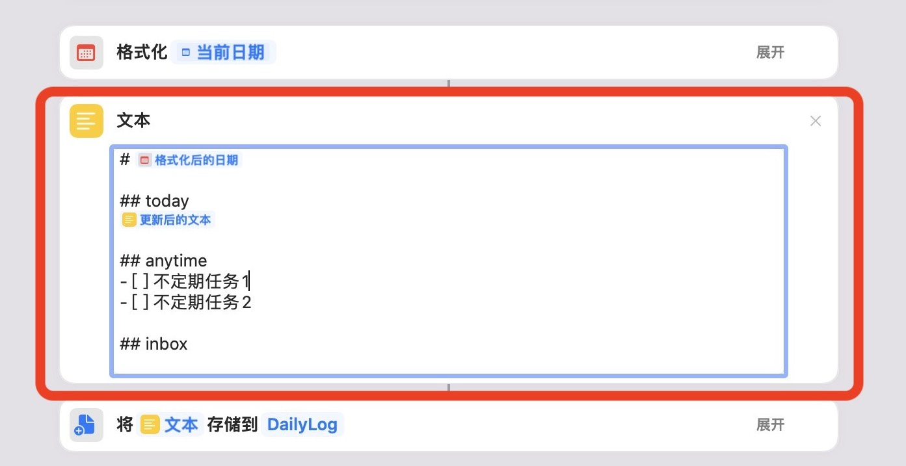
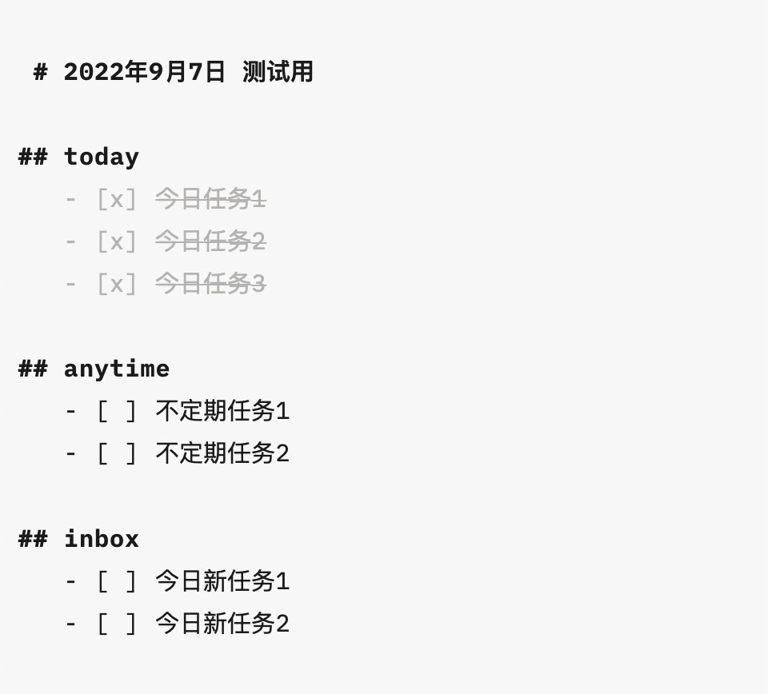

看到这篇用纯文本进行任务管理的[文章](https://sspai.com/post/71705)，自己也想实践一番，经过两天的研究，摸索出了一个在Mac上进行纯文本任务管理的方法：

1. 和作者一样，将日历作为外部工具，装入生活、工作中的大小事项，帮助我们实现提醒和循环任务两个功能。
2. 通过shortcuts，将日历中的当日事项汇总生成一个markdown文件，作为当日的待办事项。
3. shortcuts生成当日待办后会自动打开文件，同时打开前一日的待办文件。两相对照，如果前日有遗漏的任务，能手动复制到当日。

用纯文本进行任务管理，最大的优点是方便加备注（例如解决问题的思路、想法、会用到的网页链接等等），它就像一张白纸，鼓励你把所有想法写上去。

当然，对比市面上一些比较成熟的待办工具，例如我之前使用的滴答清单，这个方法也有一个明显劣势，就是没有任务分组或标签体系，进而也很难实现智能视图、过滤器（filter）这样的高阶功能。

不过对于我来说，这样的功能并非刚需，我自己是通过shortcuts给自己的任务分了三个大类：

1. today，从日历获取的当日任务都会自动归到这个类目。
2. anytime，不确定执行日期的事项，作为shortcuts里的固定事项，每天生成一遍，完成后手动删除。

3. inbox，当日的新任务都加到这个类目。为了快捷添加新任务，我也做了一个shortcuts，自动将新任务输入到待办文件的最后一行。

最后放上shortcuts链接，大家可自行取用。

生成每日待办：[DailyLog](https://www.icloud.com/shortcuts/bb8be80b8552454a94afc87d4a44f8d6)

添加任务到当日inbox：[Add to DailyLog](https://www.icloud.com/shortcuts/aab26f8053034980a0e0ec272f07bbbd)