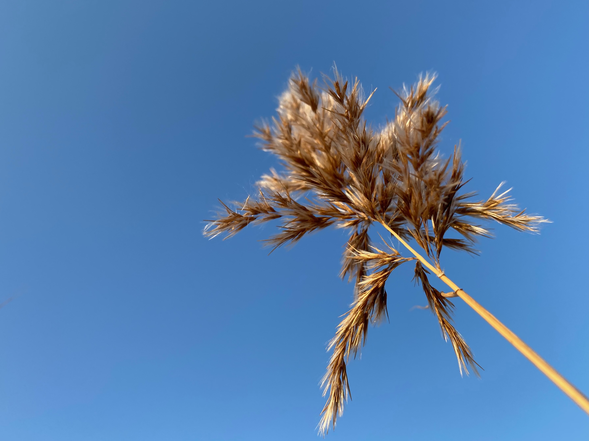
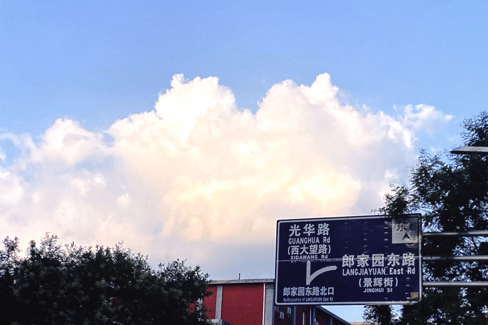
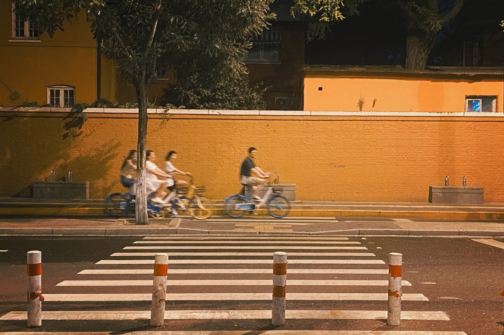
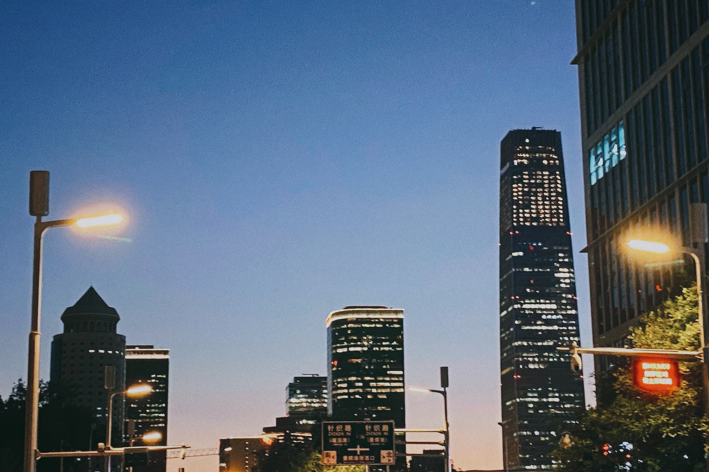
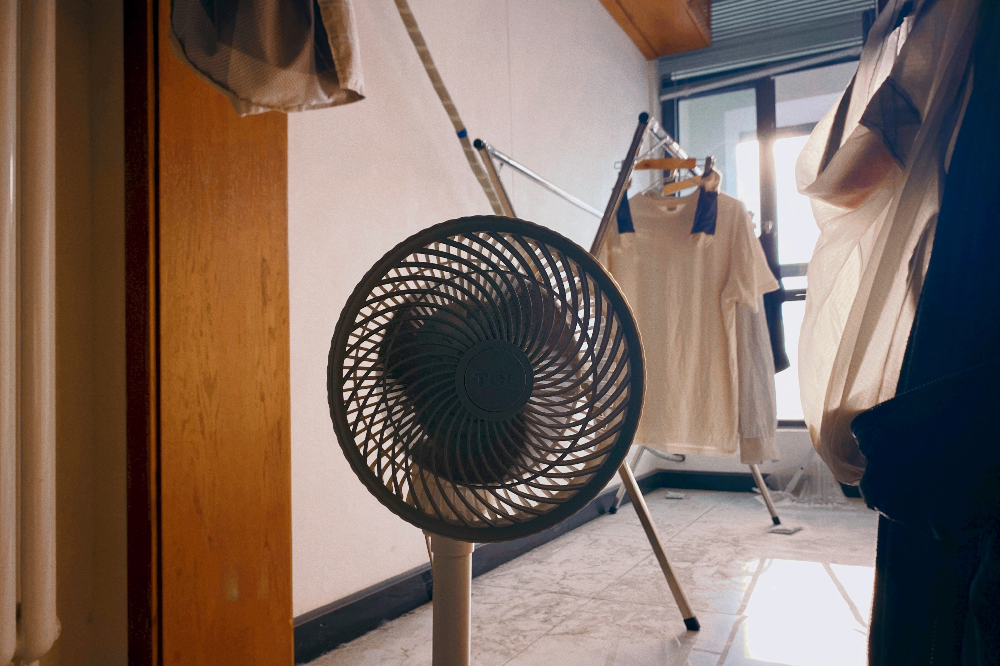
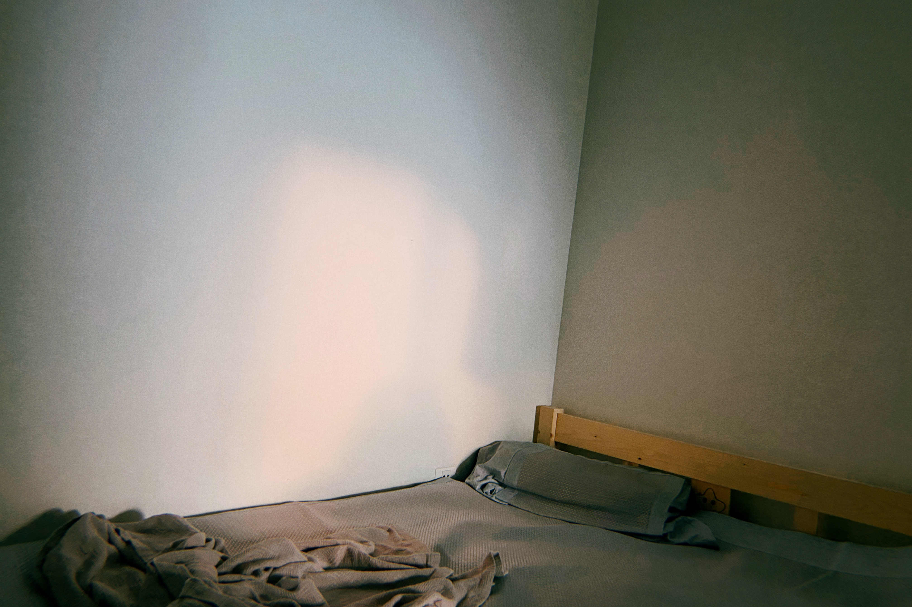

<iframe allow="autoplay *; encrypted-media *; fullscreen *; clipboard-write" frameborder="0" height="175" style="width:100%;max-width:660px;overflow:hidden;background:transparent;" sandbox="allow-forms allow-popups allow-same-origin allow-scripts allow-storage-access-by-user-activation allow-top-navigation-by-user-activation" src="https://embed.music.apple.com/cn/album/%E5%BA%94%E8%AF%A52022/1637052066?i=1637052266"></iframe>

一株芦苇
 <small>2021年10月31日 16:24 
北京市大兴区亦庄镇南海子公园</small> 

 
 
下班后的风景
 <small>2022年7月29日 18:39 
北京市朝阳区建外街道</small> 

 
 
半夜游街，看到了一群骑车的人
 <small>2022年7月29日 23:33 
北京市东城区建国门街道</small> 

 
 
这个时候的北京，恍惚间有一点点曼哈顿的感觉 <small>2022年8月9日 19:54 
北京市朝阳区建外街道</small> 

 
 
试图捕捉阳光
 <small>2022年9月11日 17:05 
北京市大兴区旧宫镇</small> 

 
 
试图捕捉最后一缕阳光
 <small>2022年9月11日 17:50 
北京市大兴区旧宫镇</small> 

 
 