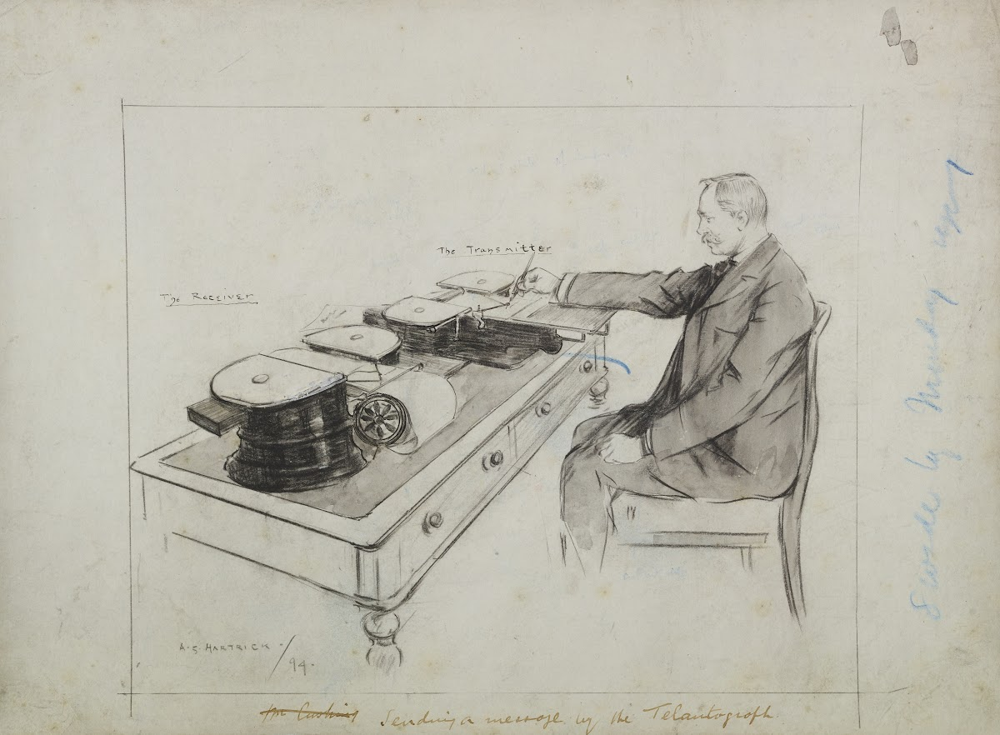

「手写电报机」（telautograph）是现代电报的古典雏形，也是一个非常有想象力的发明。
1. 它有一个发送端和一个接收端，发送端的笔捆了根线。笔在书写的时候，会带动线运动，产生电流。接收端也有一根笔和控制笔的线，在接收到电流以后就能复现发送端笔的运动轨迹，实现「自动书写」（autograph）。
2. 它的技术原理和电话差不多，如果仅仅是为了通信交流，包括电话在内，同期可以取代他的技术太多了。但这丝毫不妨碍「手写电报机」散发出来的想象力，一支能自己动的笔，怎么看都像是魔法！
3. 它的单词构成也非常贴切，tele+auto+graph，连在一起就是远距离自动书写的意思，也可以理解成「远程亲笔签名」。