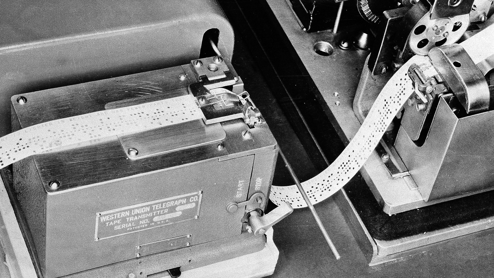
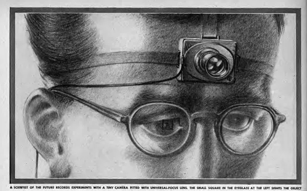
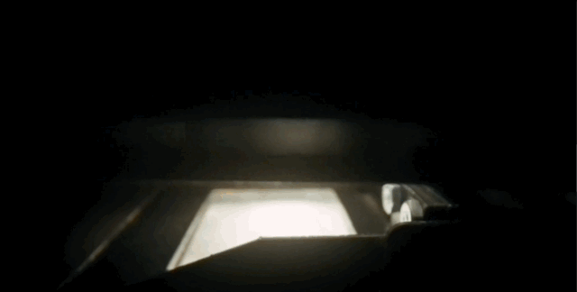
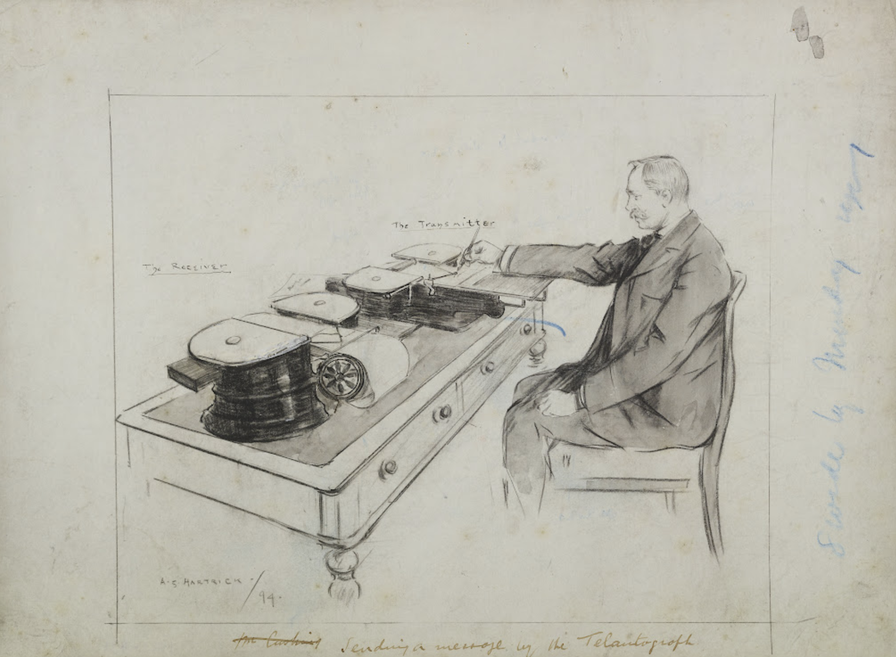

原文链接：[As We May Think](https://www.theatlantic.com/magazine/archive/1945/07/as-we-may-think/303881/)（首次发表于1945年7月的[《大西洋月刊》](https://www.theatlantic.com/)）

编译：dkphhh（enhanced by [GPT-3.5](https://platform.openai.com/docs/models)）

观前提醒：

1. 因为原文年代久远，涉及到很多古早时期的技术细节，为了便于理解，我在译文中加了注解，都放在（括号）里。
2. 原文除了头图以外没有配图，其余配图都是我加的。

> 想象一下，未来存在一种设备，能存储所有的书、资料、通讯信函，而且它是机械化的，所以能非常快速灵活地查阅。相当于是人类记忆的外挂。

作为美国科学研究与开发办公室的主任，Vannevar Bush 博士需要带领大约6000名美国顶尖科学家，将科学成果应用于战争（指第二次世界大战）。战争结束后，这篇影响深远的文章鼓励科学家们继续前行。他在文中呼吁，科学家们应当着手普及人类积累的巨量知识。多年来，科学家们的发明创造更多地在增强人类改造世界的能力，而非理解世界的能力。例如，机器代替了双手，显微镜增强了人类的视觉，战争中的武器与侦察设备是最新成果，但还不是现代科学的尽头。现在，Bush 说，一些工具，只要合理开发，就能帮助我们了解和掌握传承下来的所有知识。如今科学家们已经摆脱了战争的泥淖，开发、完善这些用于和平的工具，应当成为他们工作的首要目标。和爱默生在1837年发表的演讲《美国学者》一样，Bush 博士的这篇文章也呼吁人需要建立一种新的获取知识的方式。（原文直译是「建立一种新的人和知识之间的联系」，但爱默生的演讲和 Bush 这篇文章的着眼点其实都是获取知识的方式。）—— 《大西洋》编辑按

***

这不是一场科学家的战争，我们所有人都参与其中。因为这场战争，科学家们放下了过去的专业竞争，通力合作，并在这一过程中获益良多。在真正的合作关系下，工作着实令人愉悦。现在，对于大多数人来说，战争已接近尾声。那么，科学家们接下来该做什么呢？

对于生物医药领域的科学家而言，这一问题无须迟疑。因为战争并没有让他们偏离旧有的研究路径，大多数人依然可以在和平年代继续战时的研究，两者的目标几乎一致。

偏离旧有研究路径最远的，是物理学家。他们放弃了过去的学术追求，投身到战略性武器装置的研发中。现在，他们要为自己被分配的任务寻求一个新出路。他们在武器研发上尽了自己的责任，和盟国的其他物理学家们一起努力工作，击退了敌人。他们感受到了成功的振奋。他们是伟大团队的一分子。现在，随着和平临近，我们不禁要问，值得他们追求的新目标在哪里？

# 1

科学应用与科技发明为人类带来了什么持续性的收益？首先，科学技术提升了人类对物质世界的控制力，改善了人类的衣食住行，帮助人类摆脱了原始的生存环境。科学提升了人类对生物过程的认知，人类得以逐步摆脱疾病的困扰，获得了更长的寿命。科学正在阐释人类生理和心理之间的相互作用，人类的精神健康水平也有望得到提升。

科技为人类提供了最便捷的沟通方式。科技还让人类能记录知识，并对知识进行提取和利用，知识得以穿越个体的生命周期，在整个人类历史中得到传承和发展。

人类科学是一座不断生长的山峰。但随着学科不断细化，我们正陷入泥淖。学者们正被越来越多的新发现、新结论震撼，但根本没有时间去学习、掌握，在这一过程中，学科细化显得尤为必要，但我们为打破学科间藩篱所作的努力，却还不够。

从专业角度讲，我们传播与评审研究成果的方法十分老旧，已无法满足现在的需求。如果我们能量化读、写论文的时间，二者的比值会让人大跌眼镜。有的学者，努力阅读文献跟进前沿学术，也会羞于检验自己过去一个月的阅读帮他产生了什么样学术成果。[孟德尔的遗传学定律](https://zh.wikipedia.org/zh-cn/%E5%AD%9F%E5%BE%B7%E5%B0%94%E5%AE%9A%E5%BE%8B#%E5%8E%86%E5%8F%B2)问世后，在近一代人的时间里默默无闻，因为他的著作并没有被那些能掌握并发展它的人看到。这样的悲剧仍在我们身边不断发生，因为真正的成就被无关紧要的成果掩埋了。

困境的根源并非学术著作过于繁杂多样，而是我们处理这些文献的能力不济。人类的经验总结正在以指数级增长，而我们在文献迷宫中搜寻宝物的工具还停留在大航海时代。

但改变的曙光已经出现，新生的强大工具正在投入使用。通过物理感知方式「看」东西的感光元件推动了摄影技术的发展，现在不管看得见看不见，都能被拍下来。真空管只需要比蚊子扇动翅膀还小的能量，就能操控巨大能量。阴极射线管能显示转瞬即逝的画面，和它的速度相比一微秒都显得十分漫长。组合继电器在执行连续复杂动作时，比人类操作员更可靠，同时速度快上千倍——现在，有充足的机械设备辅助我们处理学术资料。

两个世纪前，莱布尼茨设计了一种计算器，其特性已经和现在的大部分键盘设备差不多了，但最终没有被投入使用，盖因当时经济条件有限：在工业时代前，建造莱氏计算器的人力成本远超其节省下的人力成本——计算完全可以靠纸和笔完成。而且，莱氏计算器还很容易坏，可靠性堪忧。在那时和之后的很长一段时间，复杂等同于不可靠。

巴贝奇（Charles Babbage，另一个设计计算器的发明家）得到了当时称得上慷慨的资助，但也没有将他的计算器生产出来。他的设想听起来不错，但实际建造和维护费用依旧高昂。假使一个法老得到了汽车的详细设计图，并且他能完全理解，把汽车成千上万的零件制造出来也要耗尽他王国的所有资源，即便真的造出了一辆车，也会第一次上路前往吉萨的途中抛锚。

当今的经济基础，已经能支撑我们制造可更换零件的机器，即便结构复杂，表现也相当可靠。这粗笨的打字机、电影摄像机、或者汽车就是证明。一旦完全理解了电接触，所有的困难都迎刃而解了。像自动电信交换机，它有成千上万个这样的电接触点，但至今依然可靠运行。将一张金属制成的蜘蛛网封装在纤薄的玻璃容器里，将一根线被加热到泛光——简而言之，收音机等设备里的真空管，正在被数以万计地生产、打包，然后插上插座——正常运行！生产中最精细的部分，是精准的定位与对齐，过去需要花费一位能工巧匠数月的时间。现在只需要30美分就能做一个出来。我们的世界已经能廉价生产复杂且可靠的设备，一定有某个新东西将应运而生。

# 2

一则信息，如果能用于科学研究，一定会被无限延展、存储，以及最重要的被查阅。如今，我依旧用传统的手写、摄影或绘画方式记录信息。但我们现在也可以通过胶片、黑胶唱片和磁性线圈记录信息。即使，完全创新的记录手段没有出现，现存的记录手段也会完善和发展。

当然，摄影技术的发展进程不会停止。更快的感光材料和镜头、更加自动化的相机，可以扩展微型相机概念的精细化感光材料，这一切近在眼前。现在，让我们用逻辑来想象一下这个趋势将产生的结果。未来的摄影爱好者，头上或许会带一个仅比核桃略大的设备。它能拍摄3毫米的方形照片，可以被投影也可以被放大，它的放大倍率，其实只是现在的十倍而已（胶片的主流规格是 35mm，所以是10倍放大倍率）。和现在相比，这个镜头的对焦距离非常广，可以适应任何肉眼可见的距离，因为它的焦距很短。相机内置一个传感器（原文是photocell，也就是光电池，一种光敏元件，现代数码相机里传感器上的每一颗像素，就是一个用硅制成的小型光电池），我们现在也有相机搭载了这个东西，这个传感器可以自动根据光线条件调节曝光时间。相机内的胶卷有100张，操作快门和更换胶片的发条，只需要在插入胶卷时上紧一次就可以了。照片拍出来是彩色的，如果用两个相隔的镜头拍摄，还有可能是三维（类似3D电影的效果）的，因为三维成像技术的重大突破近在咫尺。

触发快门的绳子垂到袖子的位置，手指很容易触碰。轻轻一按，照片就拍好了。在一幅普通的眼镜上，有一个极细的线框，线框在镜片的顶部，不会干扰视线。当物体出现在线框内，相机就准备拍摄了。当学者们往来于实验室和田野，看到值得记录的东西，就可以按下快门，甚至都听不到快门声。这个设备是不是很科幻？但真正科幻的其实是，我们可以拍摄海量照片。

未来会发展出「干版摄影」吗？其实现在就有两种形式的「干版摄影」。当 Mathew Brady 拍摄南北战争时，版（可以理解胶片）在曝光时必须是湿的，而现在的胶片只需要显影时是湿的（胶片必须浸泡在化学液体中才能显影）。未来，成像材料可能全程都没有必要湿。含有重氮染料的胶片已经存在很久了，这种胶片不需要冲洗，一按快门，影像就被定格了。氨气会破坏未被曝光的染料，之后就能在阳光下取出照片检查了。现在这个过程还很缓慢，但总有人会改进它，而且它还没有困扰影像研究员的颗粒感难题。对于大多数人而言，按下快门就能看到照片，是一种进步。

目前使用的另一种技术成像速度也很慢，还多少还有点笨拙。五十年来，人们一直在使用浸渍纸，纸张中含有的碘化合物遇到电流会产生化学变化，导致电流经过的地方变黑，所以这一技术目前也被用于记录信息。只要（带点的）指针一经过，就会留下痕迹。如果指针移动时，指针上的电势发生变化，留下的线条也会出现颜色深浅的变化。

这项技术目前用于传真。图像发送方通过传感器一行行地扫描图像，将光信号转化为不断变化的电信号，通过电线传输到远处的信号接收方，不断变化的电信号让指针上的电势也不断变化，就能纸上绘制一组又一组深浅不一、紧密排列的细线。在每一个瞬间，指针绘制的黑色线条都和传感器扫描的黑色线条一模一样。因此，当发送方的图片被完整扫描一遍后，接收方那边就生成了一份图片的复件。

这一技术不仅可以扫描照片，也可用于拍照。这整个系统可以被看作是一台摄像机，增加一些功能模块，就可以远程拍照。当然，也可以不要这些功能模块。虽然它成像很慢，而且画质细节不好，但它为发展即拍即得的「干版摄影」提供了另一种技术路径。

如果觉得这个技术会一直笨重、缓慢、细节粗糙，就有些无知者无畏了。如今的电视机一秒能传输16帧还算不错的画面，而电视机所使用的技术和前文所述的技术只有两点差异。其一，电视机的画面是电子束产生的，不是指针绘制的，因为电子束能更迅速的生成图像。另一个差异则是屏幕的使用，屏幕只会在被电子束撞击的一瞬间显示画面，而不像前文提到的化学试纸和胶片，成像是永久的。这种成像速度对于电视而已十分必要，因为电视需要显示动态画面，而非静止画面。

用化学药剂处理过的胶片取代屏幕，这套装置就能传输单张图像而非连续图像，一台高速干版摄影机就成了。这种干版摄影特制胶片需要比现有样品更快的成像速度，但这是有可能做到的。这个方案更大的难点在于，需要将胶片放在一个真空腔内，因为电子束在真空环境才能正常运动。但这个困难也可以解决，如果存在一种隔板，能让电子垂直穿过并且在穿过后不侧向扩散，那么我们就能向隔板的一侧发射电子束，让胶片紧紧贴在另一侧。这样的隔板，我们肯定能做出来，即使粗糙一点，也无碍于技术的发展。

和「干版摄影」一样，显微摄影也有很长的路要走。缩小图片尺寸、通过投影而非直接看的方式观察，这一技术路线非常有潜力，不应被忽视。在用于学术目的的微缩胶片领域，光学投影搭配小型化的摄影技术已经产生了一些成果，其潜力不言自明。现在，有了微缩胶片，线性缩小20倍后再放大检查，图像依然清晰。目前这项技术的限制是胶片的清晰度，光学系统的性能和光源的效率。目前这些都在快速发展。

想象一下，未来的微缩胶片能线性缩放100倍，而且和纸一样薄，当然更薄也可以。即使在这样的条件下，一本书的体积将是它微缩胶片复制品体积的10000倍。《大英百科全书》将被缩小到火柴盒的大小。图书馆里上百万卷的图书只需占据桌子的一角。如果说，自活字印刷术发明以来，人类以杂志、报纸、书籍、小册子、传单、通讯函件等形式生产出来的信息，相当于10亿本书，那么所有这些东西，经过整合压缩，一辆面包车就能拉走了。仅仅是压缩当然还不够。一个人不仅需要存储信息，还要能查询信息，这方面的问题下面再说。即使在现代大型图书馆，也只有一小部分人能充分利用这些资源。

<small>微缩胶片确实在《As We May Think》刊发不久后得到广泛应用。1950年代，随着微缩胶片阅读器普及，很多图书馆开始配备微缩胶片阅览室。上图是《怪奇物语》里 Nancy 和 Robin 在图书馆里用微缩胶片阅读机查阅旧报纸，该剧的背景设定是80年代。</small>

考虑到成本，压缩非常重要。一本微缩胶片版《大英百科全书》的物料成本只需要一块铜板，无论快递到什么地方，都只需要一分钱。那么印制100万份，所需要的成本是多少呢？印刷一张标准尺寸的报纸，成本只要一分钱的几分之一。一本微缩版《大英百科全书》正好可以印刷在一张 8.5 x 11 英吋 （也就是标准尺寸）的报纸上。一旦这一技术可用，搭配上未来的光学复印技术，除掉物料成本，大规模批量复印的单件成本可能只有一分钱。母版的准备？那是接下来要讨论的问题。

# 3

要创造信息，我要用笔写或者敲打字机。接下来是修缮、订正，然后是复杂的排版、印刷、传播。想象一下这个流程的第一步，未来的作者，会不会不需要手写或打字，直接用嘴说就能写文章？对着速记员或者留声机讲还不够直接。如果想将语音直接转化成文字，各种要素其实已经齐备。我们还需要的，其实是利用现有技术实现对语言的转化。

在最近的世博会上，展出了一个名为 Voder 的机器。一个女孩敲击键盘，机器就会发出可辨认的语音。在这一过程中没有人类声音的介入，这些按键仅仅是将电子器件产生的振动组合到了一起，并通过扬声器释放出来。贝尔实验室里还有这个机器的逆向版，叫 Vocoder。扬声器被麦克风取代，用于收声。对它说话，就会触发对应的按键。这个设备或许能成为「语音转文字原型机」的组成部分。

另一个组成部分来自速记机，在公共展会上，大家经常遇见这个让人不安的机器，一个小女孩会对着它噼里啪啦敲键盘，还时不时四处张望，或用一种令人不安的眼神盯着演讲者。速记机器会吐出一串串写满了的纸条，不过速记员记录的都是字音组合成的单词，不是正常的语言，一般人看不懂。随后，速记才会被被重新整理成正常的语言。如果将两者结合，用 Vocoder 驱动速记机，就会组合成一台将语音转化成文字的机器。

我们现在的语言不是特别适合这种机械化的记录方式。我也很意外，通用语言的发明者们没有创造出一种更适合机械化记录和转化的语言。但机械化的浪潮可能会推动这一进程，尤其是在科研领域，因此外行人可能会更加看不懂科研领域的术语。

我们现在可以想象一下未来的科研人员。他手里什么也不用拿，人也不必一直待在座位上。他一边走动、观察，一边拍摄、解说。视频和配音的时间戳会自动记录。如果他要外出实地考察，他可能会将无线电和收音设备连接起来。当他在夜里思考笔记时，他又会对着收音设备说自己的想法。文字版的记录和照片，可能都是微缩版，所以他需要通过投影的方式查看这些材料。

但是，在数据的收集、观察阶段，以及对笔记进行增删减改的过程中，还有许多事情需要做，在这一阶段，人类的深思熟虑是不可替代的。但创造性思维和基础的重复性思维有很大不同。对于后者，机器可以成为强有力的辅助。

例如，加总一列数据就属于重复性思维，这种事情早就该交给机器处理了。诚然，即便是如此简单的工作，目前也必须交有人的介入，因为你得识别数字，然后按下对应的按键。但现在不用人类介入了。通过传感器识别印刷文字，识别后立刻按下对应按键的机器，已经诞生。这台设备有三个主要元件组成，分别是扫描文字的传感器、识别信号的电路和控制实际按键动作的中继电路。

上述三个动作是必须的，因为这个过程就是人类读写字母的过程。如果我们用卡片打点的形式记录信息，机器读取会相对更加方便。实际上，如果把点换成孔，就是我们使用了很久的打孔制表机，这是由 Hollorith 为人口普查发明的机器，如今依旧在商业领域广泛使用，一些比较复杂的业务，没有这类机器根本无法开展。

加，只是其中一个步骤。数学计算，还包括：减、乘、除，以及结果的存储、清除以及打印。具备这些功用的机器只有两种：第一种是键盘计算器，用于会计或类似工作，可以手动输入数据，但连续运算通常是自动的。另一种是打孔计算器，不同的步骤由不同的机器执行，卡带需要在不同的机器间传递。两种机器都很实用，但在复杂运算面前，两种机器还尚显稚嫩。

在物理学家试图观测宇宙射线时，速度更快的电子计算崭露头角。为了实现目的，物理学家迅速制造了一台真空管设备，能以100000每秒的频率测量电脉冲。未来，更先进的计算设备一定是电子的，而且计算速度将是现在的100倍，甚至更多。

此外，它们的功能可能更多，所以稍加改造就能适用于更广泛的场景。我们或许会用控制卡或胶片来操控他们，这些控制卡或胶片已经写入了指令，所以机器知道该调用哪些数据、执行哪些步骤，即使是执行复杂的运算，速度也非常快，得出的结果也能很快分发或保存下来用于下一步操作。这样的机器有处理巨量数据的「好胃口」。未来，或许有一屋子敲键盘的小姑娘为它送来源源不断地指令和数据，而它只要几分钟就能将一张张计算结果送出来。未来会有几百万从事复杂工作的人，数据处理的需求将源源不断。

# 4

重复性工作不仅局限于计算和统计。实际上，在用既有的逻辑流程处理信息时，只有选择信息和选择处理方式是创造性工作，此后的整个处理操作都是重复性的，因而很适合交给机器去做。但在计算领域之外，机器的应用并不广，这主要是市场需求导致的。商用需求的广泛市场保证了，只要生产技术跟得上，批量生产的计算设备马上就能问世。

用于数据分析的机器就不具备这样的条件——没有足够大的市场，也没有足够多的用户。但是，用于解决微分方程、函数方程、积分方程的机器已经存在。现在，还有很多特定用途的机器，例如用于预测潮汐的谐波合成器。未来，这样的机器会越来越多，但一定是先出现在实验室或一小部分人手里。

如果科学推理仅限于数学计算，那么我们对物理世界的探索不会走这么远。同样的，一个人也不可能仅通过概率计算赢下扑克游戏。算盘，就是那个几排珠子平行排列的计算设备，让阿拉伯人比世界早几个世纪理解了位值制记数法和0的概念。算盘是个很实用的工具，所以现在依然存在。

算盘和现在的键盘计算器相比相去甚远，今天的计算器和未来的计算器相比，肯定也有同样的差距。但即便是新机器，也不会将科学家带到他们的应许之地。如果科学家们想做点别的，就得将自己的大脑从重复性计算工作中解放出来。数学家不是能轻易操弄数字的人，他们甚至用微积分进行方程转换都算不利索。数学家首先是能在高抽象纬度上熟练运用逻辑符号的人，还应该是能凭直觉判断该用什么数学方法的人。

除此以外的所有工作，数学家都应该交给他的机器，就像一个人开车，他只需要握好方向盘，剩下的事情都交给车盖下的精密装置就好了。只有这样，数学才能更高效地被运用于化学、冶金学、生物学，为我们带来新知识。因此，能帮科学家解决高等数学问题的机器，变得越来越多。其中一些将足够别致，能满足当代工艺品鉴赏家的挑剔审美。

# 5

不过，科学家并不是唯一会操弄数据并用逻辑检视其周遭世界的人。科学家们愿意将任何运用逻辑思考的人纳入这个团体，就像英国的劳工领袖也能被册封骑士一样。当逻辑思维被应用时，或者换个说法，当逻辑沿着既定的路径前进——机器就有介入的机会。形式逻辑过去一直是老师塑造学生思维的强大工具。现在，只要巧妙运用中继电路，一个能按照既定逻辑路径进行推理演绎的工具，非常有可能被构造出来。只要设定好逻辑规则，按下按钮，机器就能源源不断地输出结果，所有的结果都符合此前设定的逻辑规则，它出错的概率不会超过现在的键盘加法机。

数学演算既复杂又困难。如果在进行演算时，有一种正确率更高的方式，肯定更好。过去，用于高阶演算分析的机器本质上都是「解方程机」。现在，「方程变换机」的构想正呼之欲出，这台机器能根据严格的高阶逻辑，重新排列方程的关系。但问题是，数学家们表达方程关系的方式非常粗糙。他们使用的符号体系混乱而无序，又缺乏一致性。一群最有逻辑的人却做出了这样的事，属实奇怪。

一个新的，可能是进位制的符号系统，一定会在数学逻辑简化为机械流程前出现。这个世界上，除了数学家需要运用严格的逻辑进行推理，日常生活中也有许多应用逻辑的地方。或许，有朝一日我们能用机器轻松生成论据，它的可靠性将和现在的收银机一样。不过，逻辑机器和收银机还是有本质区别。

学者们需要频繁地收集信息、整理信息，但我们现在的处境似乎比过去要糟糕的多。因为现在我们有太多信息了，很难在里面检索出对我们有价值的部分，而这一步要比单纯的摘录重要得多，它能影响人类获取知识，进而影响人类创造价值。检索是如此的重要，但我们却深陷巨量信息的泥淖。我们有数以百万计的优秀思想和孕育它们的经验，但都被名为检索的石墙封锁，但如果一位学者经过一周的辛苦搜寻只能获取一份有价值的信息，那么他的研究就会落伍。

总的来说，现在我们检索信息就像木匠用石凿雕花，工具原始且不称手。具体到细节，其他领域检索过程中的某些步骤，早就机械化了。工厂的人事经理将几千名员工卡放入筛选机，输入预设好的代码，然后稍等几分钟，他就能筛选出一份名单，上面是所有居住在特伦顿，会说西班牙语的员工。不过，即使这样的机器面对某些场景，检索速度也会非常慢。例如，让它在存档的500万份指纹中匹配一组指纹。这类筛选机在不久后将迎来一次加速，通过传感器和微型胶片的应用，检索速度将从现在的一分钟几百次加快到一秒钟上千次，还能将选中的信息打印出来。

一个简单的检索过程，通常是这样的：检视集合内所有的项目，将有某些特征的项目挑选出来。还有另一种检索，我们可以用自动电信交换类比。你拨打一个号码的时候，它只会从一百万个可能的节点中选择并接通其中一个。它不是将所有号码都过一遍，号码的第一个数字就已经为他锁定了一个检索范围，第二个数字又将他的检索范围缩小了，以此类推，它就能找到需要接通的节点，整个过程迅速且精准，只需要几秒钟。只要社会有需求，这个速度还能更快。如果有必要的话，用真空管替代开关替代机械开关，整个检索过程只需要百分之一秒。当然，不会有人出钱为电信系统做这个升级，但这个构想放在其他领域也是可行的。

现在我们代入一个大型百货商场普遍会遇到的问题场景：每当顾客贷款购物，有一系列后续动作需要跟进：库存清单需要更新、售货员需要计算提成、会计需要入账、以及最重要的，顾客需要付钱。一台中央记录仪，可以方便地解决其中大部分问题。售货员将顾客的 ID 卡、自己的 ID 卡和和货品的 ID 卡放在操作台上，这些卡片都是[打孔卡](https://zh.wikipedia.org/wiki/%E6%89%93%E5%AD%94%E5%8D%A1)，记录着各自的信息。当售货员拉动控制杆，机器将会通过孔洞读取信息并建立关联，处于中枢的大型机器会进行计算并入账，一份正确的收据将被打印出来，由售货员交给顾客。

不过，这家店可能有上万顾客要贷款购物，在执行流程的过程中，选择正确的卡片并插入机器是必不可少的一步。现在，前文提到的快速检索技术能快速执行整个插卡抽卡的流程。但另一个问题又出现了，必须得有人输入卡片上的金额，机器才能计算。想象一下，如果卡片是用我前文提及的「干版摄影胶片」制作，那么卡片上的已有金额就能用传感器读取，新的金额能被电子束打印出来。

卡片可能是微缩的，所以不占空间、取用灵活。卡片也不需要远距离运输，只需要放进机器，传感器就能读取信息、机器就能记录信息。基于位置的点阵图也能存储信息（它存储信息的原理和[打孔卡](https://zh.wikipedia.org/wiki/%E6%89%93%E5%AD%94%E5%8D%A1)一样）。每到月底，机器能轻而易举地读取所有信息并打印一份账单。在真空管的加持下，机器还能摆脱机械结构的桎梏，只需要很短的时间——或许一秒钟就能完成所有操作。如果有需要，信息也不一定要记录在卡片上，也可以记录在磁带上，就像 Poulsen 很久以前把声音记录在磁线上一样（[Poulsen](https://zh.wikipedia.org/zh-hans/%E7%A3%81%E5%B8%B6%E9%8C%84%E9%9F%B3%E6%A9%9F)在1896年实现将音波转化为电流，并把磁力保存在钢琴线上）。这项技术的优势是简单方便，还易于擦除信息。如果用胶片，使用者就能用电视领域的常见技术，实现图像的放大以及远程投影。

快速检索和远程投影技术有很大的想象空间。在一两秒内，从100万张数据表中找出其中一张并键入信息——这样的技术在很多领域都能应用，譬如图书馆，但这就是另一个故事了。不管怎么样，这些技术再搭配其他技术，能实现很多有趣的组合。例如，和前文所述的「语音转文字机」结合，就可以实现人对着麦克风讲话，机器自动进行检索，这可比普通的文件管理员高效多了。

# 6

但是，信息检索存在的真正问题，不是图书馆缺机械设备，也不是设备不够先进，而是检索方式太落后。当信息被存档时，一般是根据字母或数字排序，你要找到它，就得层层向下筛查（就和我们查字典一样，先确定偏旁部首，再确定笔画，才能找到这个字）。一般，一条信息只能存储在一个地方，除非再复制一份。要确定一条信息该存储在什么地方，就必须建立索引规则，但这个索引规则通常复杂繁琐。而且，找到一条信息之后，我们还必须退回到检索系统的起点，才能进行下一条信息的检索。

人类思维却不是这样运作的。人类思维是依靠相关性驱动的，脑子里有一个东西，马上能联想到另一个。而联想，是通过大脑内错综复杂的神经元网络实现的。当然，人类思维也有其他特征，例如遗忘——刺激不够频繁的神经元链接会慢慢消失。但神经元处理信号的速度、神经网络的复杂性和人类知觉经验的丰富性，放眼整个自然界都是叹为观止的存在。

人类不可能把这套思维过程完全复制到机器上，但可以从中学习，在一些小的方面进行改进。经过前文的类比，第一个可以改进的就是检索方式——用相关性检索替代索引式检索，未来说不定能实现。我们不能指望机器的处理速度和灵活性达到人脑的水平，但机器可以永久存储信息——不像人类会出现遗忘或记忆模糊的情况。

想象一下，未来存在一种设备，可以存储你所有的个人文件和书籍资料。它需要一个名字，就随便取一个吧，叫「Memex」。Memex 可以存储个人所有的书籍、笔记、通讯信息，因为是机械化的，所以检索资料的速度和灵活性都超高，相当于是人类记忆的外挂。

Memex 的主体是一个书桌，或许也可以远程操作，但它首先是一件用于办公的家具。桌面有几块倾斜的半透明屏幕，可以用来投影资料，让人更舒服地阅读，还有键盘、几组按钮和拉杆。除此以外，它看起来就是一个普通书桌。

书桌内的一端是存放的资料。升级版的微缩胶片解决了书本资料占地方的问题。Memex 内部只有一小部分空间用于存储，余下部分都留给了机械组件。就算用户一年往里塞5000页资料，也得花上百年的时间才能把它填满。所以，他可以尽情挥霍存储空间。

大部分适配 Memex 的内容都将以微缩胶片的形式销售，各种各样的书、图片、最新的期刊、报纸都有微缩胶片版，能方便的插入 Memex。商业函件也是一样。如果有的资料不是微缩胶片，该怎么办呢？我们还有一种直接输入的方式。在 Memex，有一个透明的「影印台」，你可以把手写笔记、照片、备忘录、各种各样的东西放进去。放进去以后，拉动操作杆，就能将资料写入微缩胶片的空白区域。这里就用到了此前提过的「干版摄影」技术。

当然，Memex 也支持通过索引查询资料。如果用户想查找一本特定的书，他只用在键盘上敲编码，这本书就会被投影到他眼前。经常使用的编码都有助记口诀，所以他也不用翻查编码书，但如果他需要查，只要敲一下键盘，编码书就会出现在他眼前。而且，他还可以操作拉杆，朝右拉，面前的书就开始翻页，速度刚好够他每页瞟一眼。如果再右拉，速度就会达到一次翻10页。再右拉，就一次翻100页。如果朝左拉，就是往回翻页。

还有一个特殊按钮能让他立刻回到索引首页。资料库里的任何书都能通过这种方式快速呼出查阅，比在书架上找方便多了。因为 Memex 有多块投影屏幕，他可在查看一份资料的同时，呼出另一份资料。他还可以利用某种可行的「干版摄影」技术，写批注和评论。甚至还有一种可能，他可以直接用一套书写系统写批注，就像在真正的纸上写字。这个书写系统类似「手写电报机」（telautograph）上的书写系统，后者常见于铁路候车室。

<small>上图就是「手写电报机」（telautograph），一个非常有想象力的发明，也是现代电报的古典雏形。它有一个发送端和一个接收端，发送端的笔捆了根线。笔在书写的时候，会带动线运动，产生电流。接受端也有一根笔和控制笔的线，在接收到电流以后就能复现发送端笔的运动轨迹，实现「自动书写」（autograph）。关于这一技术的历史典故，可以看看 The Frick Collection 制作的[视频](https://www.youtube.com/watch?v=HLFZZ4oqnPc)</small>

# 7

所有这些其实都稀松平常，只不过我们将现有的这些机械部件和小玩意儿组合到了一起，就走向了关联性搜索。所谓关联性检索，就是能自动让一条信息自动关联上另一条信息。这也是 Memex 的基本功能。让信息关联起来的过程，非常重要

当用户（为两份资料）建立关联路径时，他首先要为关联取一个名字，让后将名字输入到编码书中，然后再用键盘输入名字。相邻两块屏幕上，投影着即将被关联的两份资料。两份文件的底部，都是空白的代码区，还有光标提示它们的存在。用户只需要按一个键，两份资料就永久关联上了，而此时两边的代码区会显示代码（也就是用户先前输入的名字）。同时，在用户的视线外，还有一串用于传感器识别、代表另一份资料索引代码的点阵图，被输入到各自的代码区。

因此，只要用户查看其中一份资料，点击资料代码区下方的按钮，就能立刻呼出另一份资料。而且，当多份资料被关联在一起形成路径时，用户可以用拉杆轮流查看这些资料，速度可快可慢，具体操作方法，和上文提及的翻书一样。这个过程，就像在物理世界里，我们从多个独立的信源处获取资料，然后将其组合在一起，成了一本新书。但又不仅于此，因为一份资料可以加入多个关联路径。

假设，Memex 的用户对弓箭感兴趣，而且正在研究土耳其短弓为何在十字军东征时的表现优于英格兰长弓。他的 Memex 里有数十本相关的书籍、文章。最开始，他在百科全书里翻查，找到了一篇有趣但粗略的概述，投到了屏幕上。接下来，他在历史书里找到了一则相关资料，然后将两篇材料关联起来。如此这般，他串联起了好多资料。他还会时不时输入一条自己的批注，这些批注要么被关联到主路径上，要么被关联到分支路径，要么和特定的材料相关联。当他发现，材料的弹性和弓的性能有很大关系后，他又创建了一个分支路径，专门归类关于弹性和物理学相关的资料。最后，他输入了一页他自己写的、非常详尽的分析笔记。如此一来，他就在资料的迷宫中，为自己的兴趣划定了一条清晰的路径。

而且这条路径不会消失。多年过去，当他和朋友谈到人类拒绝创新的种种行为，他就有了一个真实案例——实际上，（因十字军东征失败）震怒的欧洲人并没有接受更先进的土耳其弓。对这件事，他已经有了串联起各种资料的现成路径，一键呼出编码书，按几个按键就能开启这条路径，操作拉杆就能随意翻阅这些资料，在感兴趣的部分停留，或前往分支路径。因为这个资料集和当前讨论的话题有关，他将所有资料都复印了一份（别忘了，Memex 里所有资料的存储介质是微缩胶片）送给了他的朋友，如此一来，他的朋友也能将这些资料输入到自己的 Memex，还能将这一主题路径嫁接到更加宏观的主题上。

# 8

一种全新形式的百科全书呼之欲出，它由不同的资料连点成线，交织成网，它还能插入 Memex，扩充内容。对于律师而言，他整个执业生涯的判例都将触手可及，甚至还能看到同行和业内权威的。专利代理可以随时查看上百万件已经登记的专利，获悉客户的每一个利益点。被患者病情困扰的医生，可以进入相似病例的资料库快速翻查，还能参阅相关的解剖学与组织学经典著作。正在努力合成某种有机化合物的化学家，可以将自己所有的文献资料都摆到实验室的案头，循着路径查找类似的化合物，还能在分支路径上找到他们的物理与化学性质。

拥有某个民族大量史料的历史学家，可以将手中的详细史料与「跳跃」路径放在一起作为平行参考，后者仅列出了重大历史事件，也可以进入某一时期的断代史路径，纵览这一时期的社会文明。于是，我们有了路径开拓者这一新职业，他们能从杂乱无章的资料中规划出一条有用的路径。，并从中得到满足。学者的遗产不仅仅是他们的知识，对于他的学徒们而言，学者用于创造这些新知的「脚手架」也是遗产。

因此，科技将提高信息生产、存储和检索的效率。或许，用不着边际的方式描绘未来更能吸引眼球，而不是像现在这样，贴近当下正在快速发展的已知技术。当然，我们的讨论忽略掉了工程实现上的困难，但我们也没有考虑尚且不为人知的新技术，这些技术随时都有可能像真空管一样，大幅加快科技进程。

为了使这幅描绘未来的图景，不至于因贴近现实而显得乏味，我们不妨提出一种可能性，注意，这不是预言，而更像一种建议，因为基于现实延展开的预言是有依据的，而基于未知的预言，就是一种基于猜测的猜测。

人类无论是生产信息还是消费信息，都基于人的感官。敲键盘需要触觉，听和说需要听觉，看书需要视觉。未来就不会有一种更加直接的方式吗？

我们知道，当我们用眼睛看的时候，所有的信息都会经由视觉神经转化成生物电传输给大脑。这个过程和发生在电视机电缆里的成像过程非常接近：图像传感器采集到图像，转化成电信号传输到无线电发射器，最后电视接收到电信号又转化成图像播出。我们还知道，如果有合适的工具，我们甚至不需要接触电缆，靠电磁感应就能获取电缆里的电信号，进而转化出正在传输的图像，就和窃听电话一样。（结合上下文，后面这句话其实有双关意，另一层意思是，从眼睛传递到人脑的电信号也能通过同类方法被提取出来——“我黑进了他的视觉神经。”）

流淌在打字员手臂里的电信号，将她所见所闻的信息传递给了手指，这样手指才能按下正确的按键。这些信号就不能被截取吗？能不能在原始信号（也就是视听信号）传递到大脑的时候截取？或者截取转化后传递给手指的信号？

我们早就可以通过骨传导传递声音，聋人正是借助这一方法听到声音的。现在我们传递声音的方法是，将电信号转化为机械振动，然后再用人体的生物机制迅速将其转化回电信号，未来我们有没有可能不用这么复杂低效的方法？只要头上贴两个电极，现在就能绘制出能描述脑内电流活动的脑电图。虽然不可读，但我们能通过脑电图辨识出大脑功能是否失常。谁现在敢断言这个东西（脑电仪）未来会发展成什么样？

在外部世界，为了方便信息传播，无论是声音还是图像，都被转化为了电路里的电流变化。在人体内，也发生着完全一样的过程。难道，我们必须通过机械运动，才能将一种电信号转化为另一种电信号吗？这是一个具有启发性的思考，但如果要预言（这一技术的可能性）就很难不脱离现实。（如果这真能实现将物理电信号直接转化为生物电信号，就非常接近所谓的「心灵感应」、「意念交流」。）

如果人类能更好地看待自己晦暗的过往，并更加完整、客观地分析自己存在的问题，人类的灵魂或许能更加高尚。人类缔造了一个如此纷繁复杂的文明，如果他要将经验推向逻辑的终点，不至于因记忆力有限半途而废，他就必须将所有的信息处理过程机械化。如果人类能接受遗忘的特权，放下暂时不重要但可以随时找回的信息，那么人类的探索之旅将更加愉快。

科学的应用为人类建造了一间什么都有的大房子，并教会了人类如何在里面健康生活，但也让人类得以拿起残酷的武器互相厮杀。现在，科学又让人类能充分利用人类已有的知识启迪智慧。或许，还没等到人类学会用知识构建真正的良好生活，就已经在冲突中消亡了。但是，让科学应用满足人类需求的进程就此停止，或是对其失去希望，未免太可惜了。

---

**译后记**

在《诚如所思》发表两个月后，一个美国海军雷达兵在菲律宾莱特岛上的某间红十字会阅览室里看到了这篇文章，文中关于 Memex 的构想以及用机器提升人类智力的思想在他的脑海里播下了一颗种子，他就是 Douglas Engelbart。

结束军旅生涯的 Douglas Engelbart 重返校园，埋头研究自己的增智机器。1960 年代，他在斯坦福大学创办了增智研究中心（ARC）。窗口、超文本、视频会议、协同编辑这些如今习以为常的计算机概念，以及他最重要的发明——鼠标，都来自增智研究中心

1968 年，Douglas Engelbart [向世界展示](https://www.youtube.com/watch?v=yJDv-zdhzMY)了他们的研究成果。在当时的人类看来，这些东西无异于魔法。

1970 年代，深受 Engelbart 影响的研究员转投施乐帕罗奥多研究中心（Xerox PARC），第一台配备鼠标和图形界面的电脑 Xerox Alto 诞生。

后面的故事大家都很熟悉了，1979 年的某天，乔布斯拜访 Xerox PARC，发现了角落里的 Xerox Alto ，他“偷”走了施乐的创意，推出了 Lisa 和 Macintosh，40年前的种子得以生根发芽。

下面的 PDF 文档就是 Douglas Engelbart 当年阅读的那本杂志的影印版，边缘处还有他留下的批注。

<iframe src="../img/2023-08-12-21-31-as-we-may-think/annotated-As-We-May-Think-withcredits.pdf" height="792px" width="612px"></iframe>

fin