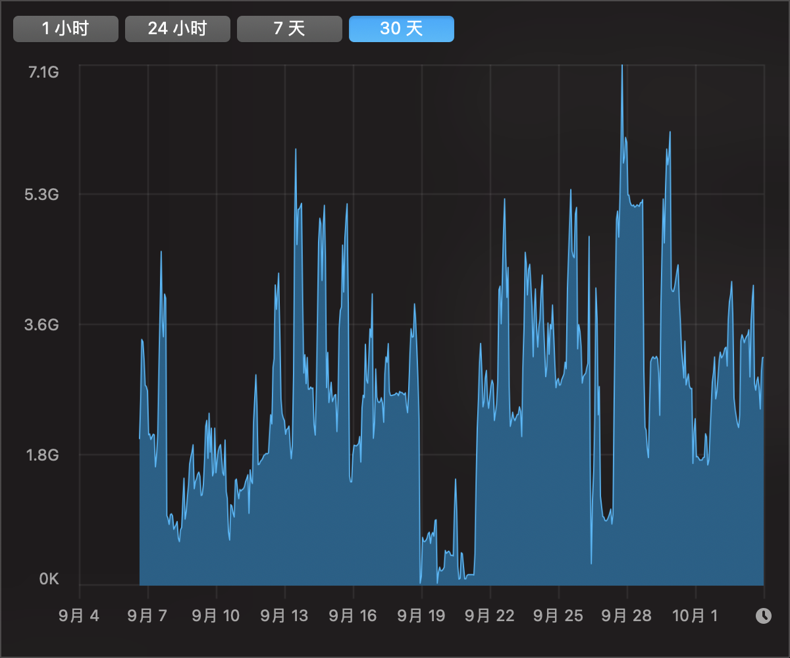

今年8月底，趁着学生优惠，借一个朋友的学生身份，我购入了一台8+256的低配版M1 MacBook air。
作为一个长期的Windows用户，这是我第一次用MacBook。怀着兴奋与好奇，我把这台电脑当玩具把玩了一个多月，到今天，它优秀的工业设计、完善的软件生态、出色的能耗比、依旧让我在使用它时怀有一丝丝幸福感。如果不出意外，这次「一时冲动」将会成为我「2021 年度最值消费」。

***

买Mac，就是买macOS。
从易用性的角度讲，macOS确实是比Windows强了一大截。产品存在的意义是帮助人们实现他们的目的，macOS就是一个能够让你安安静静做事的系统。简单和直观能让你保持专注。~~（大部分时候）~~ 不会卡顿、不会出现奇奇怪怪的问题，所以它 ~~（大部分时候）~~ 不会影响你的心情。
触控板手势直观，容易上手，动画流畅跟手得赏心悦目，大大的触控板操作起来也很方便。一些第三方软件也有自己的触控板快捷手势，例如，iA Writer的双指左滑进入预览，右滑退出预览。
Spotlight可以搜索任何Mac里的任何东西，甚至连文件内的文本内容都能被搜索到，使用得当能成为一个提升效率的利器。
按空格键预览，.docx .psd 等常用文件的格式都支持，也是一个提升效率的利器。
但macOS也并没有那么的好用。
我上手遇到的第一个困难就是分屏。苹果自带的分屏似乎只能依靠「光标长按软件左上角的绿色小圆点」实现，这和Windows的「拖动窗口到边角触发」相比，就显得有些愚蠢了。好在有很多小软件可以帮助我们实现和Windows一样智能的分屏体验，我用的是[Rectangle](https://rectangleapp.com)。
finder默认会隐藏根目录，也不显示文件路径。这是一个非常「苹果式」的设计，对于普通用户来说，省去了很多麻烦，非常体贴。但对于一些有需求的用户来说并不方便。好在显示文件路径的设置并不麻烦。在打开finder窗口后，在菜单栏选取「显示」>「显示路径栏」即可。
只要开发者允许，Mac也能运行iOS app。不过，目前的iOS app在Mac上的体验差强人意，大部分应用还是触控操作的逻辑，用光标操作不方便。

***

在刚刚上手的这段时间里，我尝试了许多苹果生态独有的效率工具，例如久负盛名的启动器Alfred，笔记软件Bear、Ulysses，GTD工具Things、Omnifocus，也试图将一些我过去使用的全平台软件，如flomo、cubox、simplenote迁移过来。
但在一番体验与权衡后，我发现，苹果的自带应用已经成为了更有「性价比」的选择。
在功能上，这些自带应用于我而言已经足够了，我本身并不需要多么专业、复杂的功能。而且，因为这些app和系统、生态紧密贴合，在体验上甚至更好。
就拿备忘录来说，只要是能使用「分享」的地方，备忘录一定可以被分享，这是一个能极大提升使用效率的特性。
在接下来的Monterey，苹果还会给备忘录带来真正的系统级killer feature——「快速备忘录」。这一功能开启后，只需要将鼠标移动至右下角，便可看到一个卡片，点击就能呼出一个备忘录页面，让用户在任何地方快速开始记录，捕捉转瞬即逝的灵感。
在iPhone上，「快速备忘录」这一功能也早就被集成进了控制中心里，无论你是在手机上聊天、看书还是浏览网页，只需要从右上角下拉打开控制中心，就能开始记录。
所以，但在快速记录这一功能，苹果生态里的任何第三方笔记App都不是备忘录的对手了。
当然，苹果在系统里给自家应用「开小灶」，多少有不正当竞争的嫌疑。但对于用户来说，使用第一方软件，并非「不道德」，相反还有诸多便利，在性能优化上苹果自家应用也有保障，积年累月地使用也不会出现卡顿，除了Apple Music——我平时很少用Mac上的Apple Music，但是他的卡死和闪退给我留下了深刻印象，以至于我不得不在这里提一句。
说了一些优点，但这并不意味着第一方app没有缺陷。
我最不能忍的，就是UI功能区的字号，对于我来说太小了，还不能调节。而且，我发现只要是使用了苹果官方开发套件的app，都有这个问题，包括我现在用来写字的iA Writer。

上面这张图是Apple Music，侧栏功能区的UI文字和右侧内容区的文字，大小对比十分明显。

***

M1芯片的性能毋庸置疑，从我过去一个月的使用来看，CPU占用基本没有超过50%的情况。

我平时还会用这台电脑玩一玩群星和文明6，在900p的分辨率下，帧数非常稳定，长时间游戏也不会卡，发热量只是「温热」还不到「烫手」级别，说明这样的游戏负载对于被动散热的M1芯片就是小菜一碟。
领先一个时代的能效比也让这台电脑成为了一个像手机一样真正的移动设备。在不插电、不退出后台app的情况下，我使用这台Mac看B站，一个小时的耗电只有10%左右，而且完全不会发烫。这个能耗表现，如果省着点用，上班不带充电头完全没问题。
但低配版8GB的内存，确实捉襟见肘。
我的日常工作大部分需要开大量网页，所以我有三个浏览器，Chrome、Edge和Safari，分工使用。一般三个浏览器的标签页加一起估计有30到40个，其中10个左右是云文档。一般当我开始满负荷工作时，Safari浏览器就会提示内存不足。

iStat记录的内存负载大部分时候都在60%左右，不过虚拟内存的波动就非常大了，我满负荷工作时，虚拟内存占用能达到5G，能明显感觉到卡顿，标签页也会重载，打开一个150多行左右的云表格，甚至出现过卡死的情况。

也是这次经历，让我放弃了在云文档上做重型工作，现在比较大的表格我都用exccel，内存占用小了一些，本地软件也不会出现卡顿。

***

我的工作内容大部分都是码字，多的时候一天估计能打上万字。对于这台MacBook的键盘，我能给7分。键盘手感比我之前的那台LG更硬更利落，打字体验不错。
但和之前MacBook的蝴蝶键盘相比，这代剪刀脚键盘的键帽面积实际上缩小了。我没有长期使用过蝴蝶键盘，但就我上手摸过几次经验，我更喜欢蝴蝶键盘的大面积按键，即使偏离一点也能准确输入。至于大家吐槽的键程短，我倒没有那么在意。

