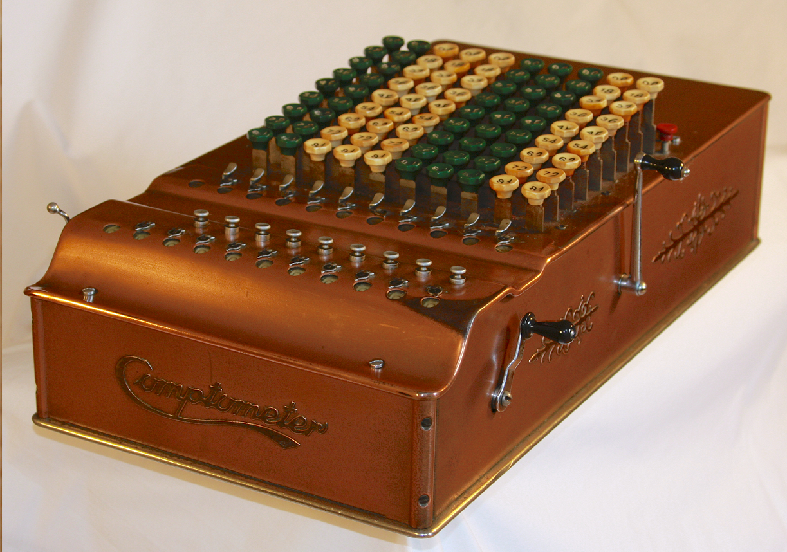

# 2023-04-30 As We May Think

原文链接：[As We May Think](https://www.theatlantic.com/magazine/archive/1945/07/as-we-may-think/303881/)（首次发表于1945年7月的[《大西洋月刊》](https://www.theatlantic.com/)）

编译：dkphhh（enhanced by [GPT-3.5](https://platform.openai.com/docs/models)）

因为原文年代久远，涉及到很多古早时期的技术细节，为了便于理解，我在译文中加了一些注释和解释，放在了（括号）里。

> 想象一下，未来存在一种设备，能存储所有的书、信息、交流通讯，而且它是机械化的，所以能非常快速灵活的查阅。它将大幅提升人类的记忆能力。

作为美国科学研究与开发办公室的主任，Vannevar Bush 博士需要带领大约6000名美国顶尖科学家，将科学成果应用于战争（指第二次世界大战）。战争结束后，这篇影响深远的文章鼓励科学家们继续前行。他在文中呼吁，科学家们应当着手普及人类积累的巨量知识。多年来，科学家们的发明创造更多地增强了人类的物理能力，而非思考能力。例如，机器用新动力增强了人类的生物力，显微镜增强了人类的视觉，现代战争中的武器与侦察设备是最新成果，但还不是现代科学的尽头。现在，Bush 说，一些工具，只要合理开发，就能帮助我们接触和掌握传承下来的所有知识。如今科学家们已经摆脱了战争的泥淖，开发、完善这些用于和平的工具，应当成为他们工作的首要目标。和爱默生在1837年发表的演讲《美国学者》一样，Bush 博士的这篇文章也呼吁人需要建立一种新的获取知识的方式（原文直译是“建立一种新的人和知识之间的联系”，但爱默生的演讲和 Bush 这篇文章的着眼点其实都是获取知识的方式）。—— 《大西洋》编辑按

***

这不是一场科学家的战争，我们所有人都参与其中。因为这场战争，科学家们放下了过去的专业竞争，通力合作，并在这一过程中获益良多。在真正的合作关系下工作，着实令人愉悦。现在，对于大多数人来说，战争已接近尾声。那么，科学家们接下来该做什么呢？

对于生物医药领域的科学家而言，这一问题无须迟疑。因为战争并没有让他们偏离旧有的研究路径，大多数人依然可以在和平年代继续战时的研究，两者的目标几乎一致。

偏离旧有研究路径最远的，是物理学家。他们放弃了过去的学术追求，投身到战略性武器装置的研发中。现在，他们要为自己被分配的任务寻求一个新出路。他们在武器研发上尽了自己的责任，和盟国的其他物理学家们一起努力工作。他们感受到了成功的振奋。他们是伟大团队的一分子。现在，随着和平临近，我们不禁要问，能配得上他们伟大成就的新目标在哪里？

# 1

科学应用与科技发明为人类带来了什么长久收益？首先，科学技术提升了人类对物质世界的控制力，改善了人类的衣食住行，帮助人类摆脱了原始的生存环境。科学提升了人类对生物过程的认知，人类得以逐步摆脱疾病的困扰，获得了更长的寿命。科学正在阐释人类生理和心理之间的相互作用，人类的精神健康水平也有望得到提升。

科技为人类提供了最便捷的沟通方式。科技还让人类能记录知识，并对知识进行提取和利用，知识得以穿越个体的生命周期，在整个人类历史中得到传承和进化。

人类科学是一座不断生长的山峰。但随着学科不断细化，我们正陷入泥淖。学者们正被越来越多的发现、结论震撼，但根本没有时间去学习、掌握，在这一过程中，学科细化显得尤为必要，但我们为打破学科间藩篱所作的努力，却还不够。

从专业角度讲，我们传播与评审研究成果的方法十分老旧，已无法匹配需求。如果我们将用在写学术著作上的时间与用在读学术著作上的时间量化加总，二者的比值会让人大跌眼镜。有的学者，努力阅读文献跟进前沿学术，也会羞于检验自己过去一个月的阅读帮他产生了什么样学术成果。[孟德尔的遗传学定律](https://zh.wikipedia.org/zh-cn/%E5%AD%9F%E5%BE%B7%E5%B0%94%E5%AE%9A%E5%BE%8B#%E5%8E%86%E5%8F%B2)问世后，在近一代人的时间里默默无闻，因为他的著作没有传递到那些能掌握并发展它的人手上。这样的悲剧仍在我们身边不断发生，因为真正的成就被无关紧要的成果掩埋了。

困境的根源并非学术著作过于繁杂多样，而是我们处理这些文献的能力不济。人类的经验总结正在以指数级增长，而我们在文献迷宫中搜寻宝物的工具还停留在大航海时代。

但改变的曙光已经出现，新生的强大工具正在投入使用。通过物理感知方式「看」东西的感光元件推动了摄影技术的发展，现在不管看得见看不见，都能被拍下来。真空管只需要比蚊子扇动翅膀还小的能量，就能控制强大的力量。阴极射线管能显示转瞬即逝的画面，和它的速度相比一微秒都显得十分漫长。组合继电器在执行连续复杂动作时，比人类操作员更可靠，同时速度快上千倍——有充足的机械设备辅助其实现科学记录的转换。

两个世纪前，莱布尼茨设计了一种计算器，其特性已经和现在的大部分键盘设备差不多了，但最终没有被投入使用，盖因当时经济条件有限：在工业时代前，建造莱氏计算器的人力成本远超其节省下的人力成本——计算完全可以靠纸和笔完成。而且，莱氏计算器还很容易坏，可靠性堪忧。在那时和之后的很长一段时间，复杂等同于不可靠。

巴贝奇（Charles Babbage，另一个设计计算器的发明家）得到了当时称得上慷慨的资助，但也没有将他的计算器生产出来。他的设想听起来不错，但实际建造和维护费用依旧高昂。假使一个法老得到了汽车的详细设计图，并且他能完全理解，把汽车成千上万的零件制造出来也要耗尽他王国的所有资源，即便真的造出了一辆车，也会第一次上路前往吉萨的途中抛锚。

当今的经济基础，已经能支撑我们制造可更换零件的机器，即便结构复杂，表现也相当可靠。看看这粗笨的打字机、电影摄像机、或者汽车。一旦完全理解了电接触，所有的困难都迎刃而解了。例如自动电信交换机，它有成千上万个这样的电接触点，但至今依然可靠运行。一张金属制成的蜘蛛网被封装在纤薄的玻璃容器里，一根线被加热到泛光，简而言之，收音机等设备里的真空管，正在被数以万计地生产、打包，然后插上插座——正常运行！生产中最精细的部分，是精准的定位与对齐，过去需要花费一位能工巧匠数月的时间。现在只需要30美分就能做一个出来。我们的世界已经能廉价生产复杂且可靠的设备，一定有某个新东西将应运而生。

# 2

一则信息，如果能用于科学研究，一定会被无限延展、存储，以及最重要的被查阅。如今，我依旧用传统的手写、摄影或绘画方式记录信息。但我们现在也可以通过胶片、黑胶唱片和磁性线圈记录信息。即使，完全创新的记录手段没有出现，现存的记录手段也会完善和发展。

当然，摄影技术的发展进程不会停止。更快的元器件和镜头、更多的自动化相机，可以扩展微型相机概念的精细化感光材料，这一切近在眼前。现在，让我们用逻辑来想象一下这个趋势将产生的结果。未来的摄影爱好者，头上或许会带一个仅比核桃略大的设备。它能拍摄三毫米的方形照片，可以被投影也可以被放大，和现在相比，这个镜头的对焦距离非常广，可以适应任何肉眼可见的距离，因为它的焦距很短。相机内置一个光电池（photocell，一种光敏元件），我们现在也有相机搭载了这个东西，这个光电池可以自动根据光线条件调节曝光。相机内的胶卷有100张，操作快门和更换胶片的发条，只需要在插入胶卷时上紧一次就可以了。照片拍出来是彩色的，如果用两个相隔的镜头拍摄，还有可能是三维（类似3D电影的效果）的，因为三维成像技术的重大突破近在咫尺。

触发快门的绳子垂到袖子的位置，手指很容易触碰。轻轻一按，照片就拍好了。在一幅普通镜头上，有一个极细的线框，线框在镜片的顶部，不会干扰成像。当物体出现在线框内，相机就准备拍摄了。当学者们往来于实验室和田野，每当他注视值得记录的东西，他就触发了快门，甚至都听不到快门声。这个设备是不是很科幻？但真正科幻的其实是，我们可以拍摄海量照片。

未来会发展出「干版摄影」吗？其实现在摄影就存在两种形式。当 Mathew Brady 拍摄南北战争时，版（可以理解胶片）在曝光时必须是湿的，而现在的胶片只需要显影时是湿的（胶片必须浸泡在化学液体中才能显影）。未来，成像材料可能全程都没有必要湿。含有重氮染料的胶片已经存在很久了，这种胶片不需要冲洗，一按快门，影像就被定格了。氨气会破坏未被曝光的染料，之后就能在阳光下取出照片检查了。现在这个过程还很缓慢，但总有人会改进它，而且它还没有困扰影像研究员的颗粒感难题。对于大多数人而言，按下快门就能看到照片，是一种进步。

还有一个技术，现在也很慢很难用。过去五十年来，我们都在使用一种被化学药剂浸染过的纸，纸张上电流经过的地方会变黑，因为纸张里的碘元素发生了化学变化。这一技术被用于记录信息，因为指针一经过，就会留下痕迹。如果指针移动时，指针上的电势发生变化，留下的线条也会出现颜色深浅的变化。

这项技术目前用于传真。指针会在纸上绘制一组又一组紧密排列的细条。在绘制过程中，电势会根据接收的信号不断变化，而信号变化又来自发送方光电池扫描的图像变化。接收方纸张上的黑色程度，完全和发送方光电池扫描的图像一样。因此，当发送方的图片被完整扫描一遍后，接收方那边就生成了一份图片的复件。

这一技术不仅可以扫描照片，也可用于拍照。这整个系统可以被看作是一台摄像机，增加一些功能模块，就可以远程拍照。当然，也可以不要这些功能模块。虽然它成像很慢，而且画质细节不好，但它为发展即拍即得的「干版摄影」提供了另一种技术路径。

如果觉得这个技术会一直笨重、缓慢、细节粗糙，就有些无知者无畏了。如今的电视机一秒能传输16帧还算不错的画面，而电视机所使用的技术和前往所述的技术只有两点差异。其一，电视机的画面是电子束产生的，不是指针绘制的，因为电子束能更迅速的生成图像。另一个差异则是屏幕的使用，屏幕只会在被电子束撞击的一瞬间显示画面，而不像前文提到的化学试纸和胶片，成像是永久的。这种成像速度对于电视而已十分必要，因为电视需要显示动态画面，而非静止画面。

用化学药剂处理过的胶片取代屏幕，这套装置就能传输单张图像而非连续图像，一台高速干版摄影机就成了。这种干版摄影特制胶片需要比现有样品更快的成像速度，但这是有可能做到的。这个方案更大的难点在于，需要将胶片放在一个真空腔内，因为电子束在真空环境才能正常运动。但这个困难也可以解决，如果存在一种隔板，能让电子垂直穿过并且在穿过后不侧向扩散，那么我们就能向隔板的一侧发射电子束，让胶片紧紧贴在另一侧。这样的隔板，我们肯定能做出来，即使粗糙一点，也无碍于技术的发展。

和「干版摄影」一样，显微摄影也有很长的路要走。缩小图片尺寸、通过投影而非直接看的方式观察，这一技术路线非常有潜力，不应被忽视。在用于学术目的的微缩胶片领域，光学投影搭配小型化的摄影技术已经产生了一些成果，其潜力不言自明。现在，有了微缩胶片，线性缩小20倍后再放大检查，图像依然清晰。目前这项技术的限制是胶片的清晰度，光学系统的性能和光源的效率。目前这些都在快速发展。

想象一下，未来能线性缩放一百倍，胶片和纸一样薄，当然更薄也能用。即使在这样的条件下，一本书的体积将是它微缩胶片复制品体积的10000倍。《大英百科全书》将被缩小到火柴盒的大小。图书馆里上百万卷的图书只需占据桌子的一角。如果说，自活字印刷术发明以来，人类以杂志、报纸、书籍、小册子、传单、通讯函件等形式生产出来的信息，相当于10亿本书，那么所有这些东西，经过整合压缩，一辆面包车就能拉走了。仅仅是压缩当然还不够。一个人不仅需要存储信息，还要能查询信息，==这方面的问题下面再说==。即使是现代大型图书馆，也只有一小部分人会去查阅资料。

考虑到成本，压缩非常重要。一本微缩胶片版《大英百科全书》的物料成本只需要一块铜板，无论快递到什么地方，都只需要一分钱。那么印制100万份，所需要的成本是多少呢？印刷一张标准尺寸的报纸，成本只要一分钱的几分之一。一本微缩版《大英百科全书》正好可以印刷在一张 8.5 x 11 英吋 （也就是标准尺寸）的报纸上。一旦这一技术可用，搭配上未来的光学复印技术，除掉物料成本，大规模批量复印的单件成本可能只有一分钱。母版的准备？==那是接下来要讨论的问题==。

# 3

要创造信息，我要用笔写或者敲打字机。接下来是修缮、订正，然后是复杂的排版、印刷、传播。想象一下这个流程的第一步，未来的作者，会不会不需要手写或打字，直接用嘴说就能写文章？对着速记员或者留声机讲还不够直接。如果想将语音直接转化成文字，各种要素其实已经齐备。我们还需要的，其实是利用现有技术实现对语言的转化。

在最近的世博会上，展出了一个名为 Voder 的机器。一个女孩敲击键盘，机器就会发出可辨认的语音。在这一过程中没有人类声音的介入，这些按键仅仅是将电子器件产生的振动组合到了一起，并通过扬声器释放出来。贝尔实验室里还有这个机器的逆向版，叫 Vocoder。扬声器被麦克风取代，用于收声。对它说话，就会触发对应的按键。这个设备或许能成为“语音转文字原型机”的组成部分。

另一个组成部分来自速记领域，就是大家在公共会议中经常遇见的那个让人分心的机器，会有一个小女孩在那儿噼里啪啦敲键盘，她还会时不时四处张望，或者用一种令人不安的眼神盯着演讲者。速记机器会吐出一串串写满了的纸条，不过速记员记录的都是字音组合成的单词，不是正常的语言，一般人看不懂。随后，速记才会被被重新整理成正常的语言。如果将两者结合，用 Vocoder 驱动速记机，就会组合成一台将语音转化成文字的机器。

我们现在的语言不是特别适合这种机械化的记录方式。我也很意外，通用语言的发明者们没有创造出一种更适应机械化记录和转化的语言。但机械化的浪潮可能会推动这一进程，尤其是在科研领域，因此外行人可能会更加看不懂科研领域的术语。

我们现在可以想象一下未来的科研人员。他手里什么也不用拿，人也不必一直待在座位上。他一边走动、观察，一边拍摄、解说。视频和配音的时间戳会自动记录。如果他要外出实地考察，他可能会将无线电和收音设备连接起来。当他在夜里思考笔记时，他又会对着收音设备说自己的想法。文字版的记录和照片，可能都是微缩版，所以他需要通过投影仪检查这些材料。

但是，在数据的收集、观察阶段，以及对笔记进行增删减改的过程中，还有许多事情需要做，在这一阶段，人类的深思熟虑是不可替代的。但创造性思维和基础的重复性思维有很大不同。对于后者，机器可以成为强有力的辅助。

例如，加总一列数据就属于重复性思维，这种事情早就该交给机器处理了。是的，即便是如此简单的工作，目前也必须交有人的介入，因为你得识别数字，然后然后按下对应的按键。但现在不用人类介入了。通过光电池识别印刷文字，识别后立刻按下对应按键的机器，已经诞生。这台设备有三个主要元件组成，分别是扫描文字的光电池，将图像转化为电子信号；识别电信号变化的电路，不同字母的电信号不一样，这个电路可以识别出来并传递给中继电路；中继电路将识别出的电信号转化为键盘的动作，识别出是A，按键A就会被按下。

上述三个动作是必须的，因为这个过程就是人类读写字母的过程。如果我们用卡片打点的形式记录信息，机器读取会相对更加方便。实际上，如果把点换成孔，就是我们使用了很久的打孔制表机，这是由 Hollorith 为人口普查发明的机器，如今依旧在商业领域广泛使用，一些比较复杂的业务，没有这类机器根本无法开展。

加，只是其中一个步骤。数学计算，还包括：减、乘、除，以及结果的存储、清除以及打印。具备这些功用的机器只有两种：第一种是键盘计算器，用于会计或类似工作，可以手动输入数据，但连续运算通常是自动的。另一种是打孔计算器，不同的步骤由不同的机器执行，卡带需要在不同的机器间传递。两种机器都很实用，但在复杂运算面前，两种机器还尚显稚嫩。

在物理学家试图观测宇宙射线时，速度更快的电子计算崭露头角。为了实现目的，物理学家迅速制造了一台真空管设备，能以100000每秒的频率测量点脉冲。未来，更先进的计算设备一定是电子的，而且计算速度将是现在的100倍，甚至更多。

此外，它们的功能可能更多，所以稍加改造就能适用于更广泛的场景。我们或许会用控制卡或胶片来操控他们，这些控制卡或胶片已经写入了指令，所以机器知道该调用哪些数据、执行哪些步骤，即使是执行复杂的运算，速度也非常快，得出的结果也能很快分发或保存下来用于下一步操作。这样的机器有处理巨量数据的“好胃口”。未来，或许有一屋子敲键盘的小姑娘为它送来源源不断地指令和数据，而它只要几分钟就能将一张张计算结果送出来。未来会有几百万从事复杂工作的人，数据处理的需求将源源不断。

# 4

重复性工作不仅局限于计算和统计。实际上，在用既有的逻辑流程处理信息时，只有选择信息和选择处理方式是创造性工作，此后的整个处理操作都是重复性的，因而很适合交给机器去做。但在计算领域之外，机器的应用并不广泛，这主要是市场需求导致的。商用需求的广泛市场保证了，只要生产技术跟得上，批量生产的计算设备马上就能问世。

用于数据分析的机器就不具备这样的条件——没有足够大的市场，也没有足够多的用户。但是，用于解决微分方程、函数方程、积分方程的机器已经存在。现在，还有很多特定用途的机器，例如用于预测潮汐的谐波合成器。未来，这样的机器会越来越多，但一定是先出现在实验室或一小部分人手里。

如果科学推理仅限于数学计算，那么我们对物理世界的探索不会走这么远。同样的，一个人也不可能仅通过概率计算赢下扑克游戏。

算盘，就是那个几排珠子平行排列的计算设备，让阿拉伯人比世界早几个世纪理解了位值制记数法和0的概念。算盘是个很实用的工具，所以现在依然存在。

算盘和现在的键盘计算器相比相去甚远，今天的计算器和未来的计算器相比，肯定也有同样的差距。但即便是新机器，也不会将科学家带到他们的应去之地。如果科学家们想做点别的，就得将自己的大脑从繁重的计算工作中解放出来。数学家不是能轻易操弄数字的人，他们甚至用微积分进行方程转换都算不利索。数学家首先是能在高抽象纬度上熟练运用逻辑符号的人，还应该是能凭直觉判断该用什么数学方法的人。

除此以外的所有工作，数学家都应该交给他的机器，就像一个人开车，他只需要握好方向盘，剩下的事情都交给车盖下的精密装置就好了。只有这样，数学才能更高效的被运用于化学、冶金学、生物学，为我们带来新知识。因此，能帮科学家解决高等数学问题的机器，变得越来越多。其中一些将足够别致，能满足当代工艺品鉴赏家的挑剔审美。

# 5

不过，科学家并不是唯一会操弄数据并用逻辑检视其周遭世界的人。科学家们愿意将任何愿意运用逻辑思考的人纳入这个团体，就像英国的劳工领袖会被册封骑士一样。当逻辑思维被应用时，或者换个说法，当逻辑沿着既定的路径前进——机器就有介入的机会。形式逻辑过去一直是老师塑造学生思维的强大工具。现在，只要巧妙运用中继电路，一个能按照既定逻辑路径进行推理演绎的工具，非常有可能被构造出来。只要设定好逻辑规则，按下按钮，机器就能源源不断的输出结果，所有的结果都符合此前设定的逻辑规则，它出错的概率不会超过现在的键盘加法机。